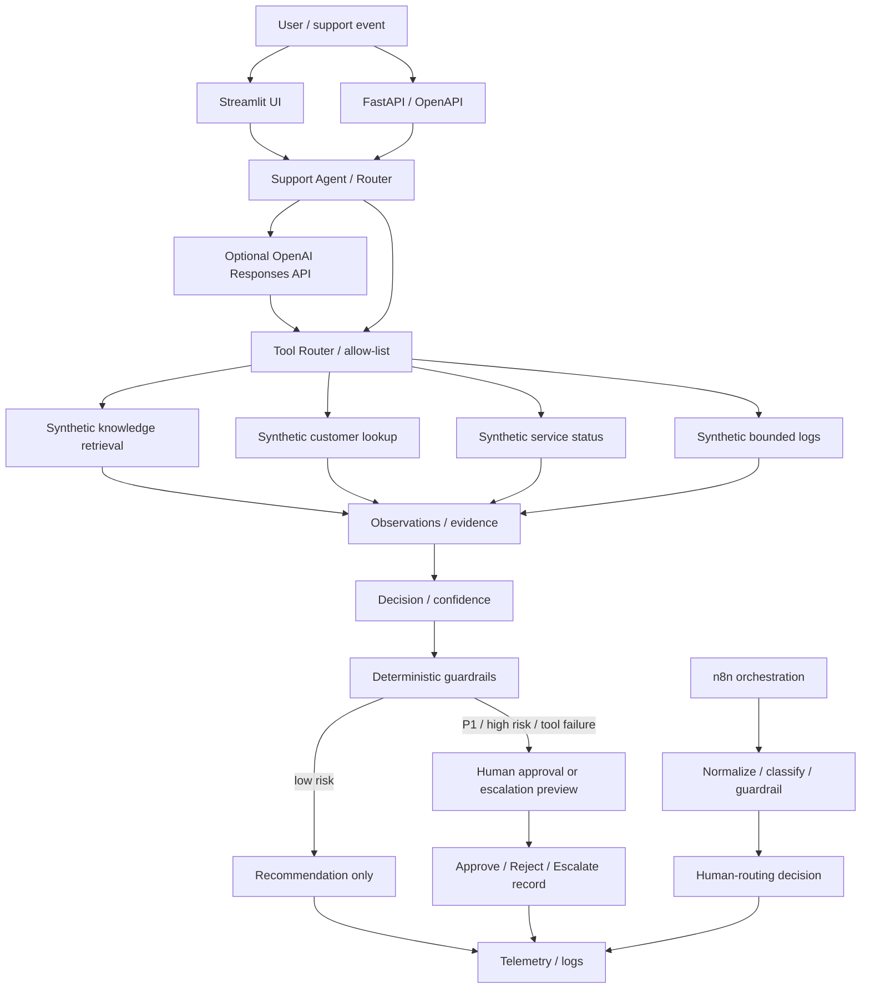

# Architecture — Agentic AI Support & Automation Portfolio

This document explains the portfolio as a system rather than as a collection of files. The project is intentionally small, synthetic, and interview-friendly: it demonstrates practical agentic-AI patterns without claiming to be a production support platform.

## System flow

## Component boundaries

### 1. User interface — `app.py`

The Streamlit UI is the interviewer-friendly surface. It provides built-in synthetic scenarios, plain-English results, an observability panel, and an interactive human-decision demonstration. It does not perform external writes.

### 2. REST API — `api.py`

FastAPI exposes the same portfolio logic through validated HTTP endpoints:

- `GET /health`
- `POST /agent/investigate`
- `POST /incident/route`
- `POST /incident/decision`
- `POST /api/diagnose`

Pydantic request models enforce basic shape and length rules before the core workflow runs.

### 3. Offline support agent — `atlas_support_agent/agent.py`

The public-safe path is deterministic and reproducible. It:

1. bounds user input;
2. retrieves synthetic customer/status/log/knowledge evidence;
3. classifies the issue;
4. calculates a confidence value using deterministic rules;
5. evaluates P1/high-risk and tool-failure guardrails;
6. returns a structured recommendation or human-escalation preview;
7. emits a decision trace and telemetry record.

The offline path is intentionally not presented as provider LLM inference. Its displayed token count is a clearly labeled rough local estimate.

### 4. Optional live LLM agent — `atlas_support_agent/live_agent.py`

Live mode requires a private `OPENAI_API_KEY`. The model may request only explicitly allow-listed tools with strict JSON schemas. Python executes the tool and returns the bounded result to the model.

Runtime controls include:

- maximum tool rounds;
- maximum model output tokens;
- approximate preflight input-token budget;
- maximum context-item count;
- bounded ticket length;
- SDK retry and timeout controls;
- provider-reported input/output/cached-token telemetry where available.

The live path records tool events and latency. Consequential external writes are not implemented.

### 5. Runtime controls — `atlas_support_agent/runtime.py`

Shared configuration keeps the limits visible instead of scattering magic numbers through the codebase. Cost estimation is disabled unless explicit per-million-token rates are configured; model pricing is not hard-coded because it changes over time.

### 6. Deterministic incident guardrail — `incident_escalation_automation/router.py`

High-risk phrases such as complete outage, production down, security breach, or data loss force a P1 human-approval route independently of an LLM.

`apply_human_decision()` records an approve/reject/escalate choice for demonstration purposes and always returns `external_action_taken: false`.

### 7. n8n orchestration

The repository contains an importable n8n workflow and a separate verification runner. The GitHub Actions verification launches the official n8n container, imports the workflow, executes it, and checks for the expected verification result.

n8n represents the orchestration layer: receive event → normalize → classify → apply guardrail → choose human-routing outcome.

### 8. API diagnostics — `api_diagnostics_agent/`

This deterministic helper demonstrates HTTP/API troubleshooting knowledge separately from the LLM path. It produces explanations, verification checks, escalation guidance, and an example cURL command for common HTTP errors.

## Support-operations modules\n\n### Engineering handoff / customer communication — `support_operations/core.py`\n\nReusable deterministic functions derive reproduction status, missing evidence, technical evidence, an engineering-ready handoff, and a separate customer-facing update from the bounded investigation result. The Streamlit layer renders these outputs but does not own the domain logic.\n\n### Pattern detection / metrics — `support_operations/core.py`\n\nThe Support Operations view uses a clearly labeled synthetic ticket set. Duplicate groups are created with transparent keyword/category rules and explain why tickets were grouped. The project does not represent these deterministic rules as a trained ML classifier.\n\n### Generic identity diagnostics — `identity_diagnostics/sso_scim.py`\n\nA synthetic SAML SSO / SCIM scenario models successful IdP authentication followed by application/workspace access or provisioning problems. It is intentionally generic and does not represent TheyDo's internal identity architecture.\n## Probabilistic vs. deterministic responsibilities

| Responsibility | LLM / probabilistic | Python / deterministic |
|---|---:|---:|
| Natural-language synthesis | Yes, optional live mode | Offline templated response |
| Requesting an approved tool | Yes, optional live mode | Tool allow-list enforced |
| Tool execution | No | Yes |
| P1/high-risk policy | No | Yes |
| Input/context limits | No | Yes |
| External-write permission | No | Not implemented; preview only |
| Human approval record | No | Yes |
| Provider token telemetry | Reported by provider | Captured/returned by Python |

## Data boundary

All customer IDs, tickets, logs, knowledge-base text, status records, and incident examples are synthetic. The repository must not be described as Avalara production code or as connected to a former employer's systems.

## Production gaps

A real deployment would still need identity/RBAC, tenant isolation, durable audit storage, secret/PII redaction, production connectors, ACL-aware retrieval, stronger prompt-injection defenses, rate limiting, service-level monitoring, formal evaluation datasets, and change-management controls.
