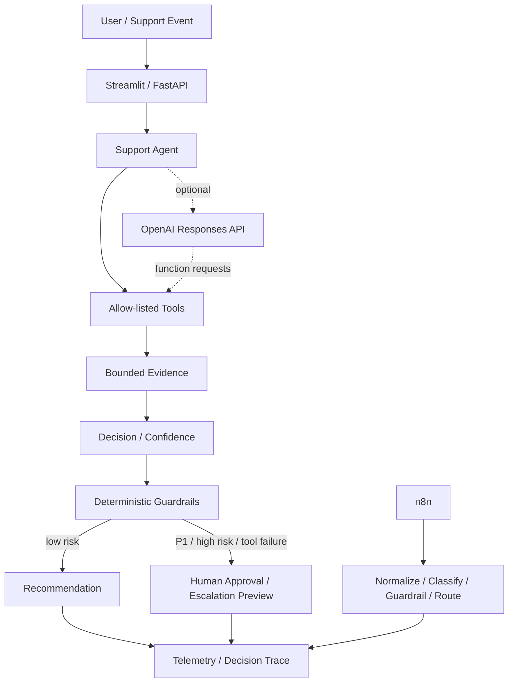

# Dane Edwards — Agentic AI Support & Automation Portfolio

[](https://github.com/danecodesnc/dane-agentic-ai-support-portfolio/actions/workflows/tests.yml)
[](https://github.com/danecodesnc/dane-agentic-ai-support-portfolio/actions/workflows/n8n-verification.yml)

**Technical Support + APIs + Escalations + Applied AI Automation**

## Start here — no technical knowledge needed

### Easiest option: open the live demo

**[▶ OPEN THE LIVE PORTFOLIO](https://ai-support-portfolio-production.up.railway.app)**

Nothing to install. Open the link, choose a scenario, and click the action button.

### Windows one-click option

If you download this repository to a Windows computer:

1. Double-click **`START_HERE_WINDOWS.bat`**.
2. The launcher prepares the local environment and opens the app in your browser.
3. Keep the launcher window open while using the demo.
4. Close it when finished.

`CREATE_DESKTOP_ICON_WINDOWS.bat` creates a desktop shortcut for future launches.

---

## What is this?

This is a public, synthetic-data portfolio showing how enterprise Technical Support and API troubleshooting workflows can be extended with:

- Python;
- AI-agent/tool-calling architecture;
- optional LLM API integration;
- RAG-style knowledge retrieval;
- FastAPI + OpenAPI/Postman testing;
- deterministic business rules;
- context/token controls;
- cost/latency observability;
- guardrails;
- human-in-the-loop approval;
- n8n orchestration;
- automated tests and CI;
- Railway demo deployment.

> **Confidentiality:** Every customer, ticket, log, service-status record, product name, and operational example in this repository is fictional/synthetic. No Avalara or other former-employer proprietary information, credentials, customer data, or internal documentation is included.

## Why did I build it?

My background is in Technical Support, Technical Account Management, API/integration troubleshooting, escalations, incident handling, and customer-facing SaaS work.

I built this portfolio to demonstrate the next layer of that work: **using Python, agents, LLM integrations, controlled tools, n8n, observability, and guardrails to automate parts of a support-investigation workflow without giving the AI unlimited autonomy.**

This is not presented as production AI work for a former employer. It is a personal applied-AI portfolio built from support-domain experience.

## What problem does it solve?

Support investigations often require the same sequence of work:

```text
Customer issue
    ↓
Gather evidence
    ↓
Check documentation
    ↓
Check customer context
    ↓
Check service status
    ↓
Inspect logs / API behavior
    ↓
Classify severity
    ↓
Recommend next steps
    ↓
Escalate when risk is high
```

The portfolio turns that sequence into a controlled, observable workflow.

## How does AI fit into it?

The optional live LLM path can interpret a ticket, request an approved tool, receive the result, and continue the investigation within a bounded loop.

The application—not the model—controls:

- which tools exist;
- how long the agent can run;
- context limits;
- output-token limits;
- P1/high-risk policy;
- human approval;
- whether external writes are allowed.

The public demo keeps external writes disabled.

## What does the agent actually do?

The flagship Support Helper can:

1. accept a synthetic support ticket;
2. bound the input;
3. retrieve synthetic customer/status/log/knowledge evidence;
4. classify the issue;
5. produce troubleshooting steps and confidence;
6. apply deterministic guardrails;
7. route P1/high-risk/tool-failure cases toward human review;
8. expose a decision trace and observability record.

The optional live path uses the same synthetic tools through LLM function calling.

## Built-in demo scenarios

The Streamlit UI includes several scenarios so an interviewer can see different behavior without inventing inputs:

1. **401 credential rotation** — recommended first demo;
2. **Ambiguous integration issue**;
3. **Low-confidence unknown issue**;
4. **P1 complete outage**;
5. **Synthetic diagnostic-tool failure**;
6. **Malformed/too-short input**;
7. **Complex multi-tool timeout case**.

The Incident Router also demonstrates an interactive **Approve / Reject / Escalate** human-decision step for high-risk routes while still reporting `external_action_taken: false`.

## Portfolio projects

| Project | What it demonstrates | Verification boundary |
|---|---|---|
| **[Atlas Support AI Agent](atlas_support_agent/)** | Support investigation, controlled tools, local retrieval, guardrails, observability, optional live LLM tool calling | Offline path + internal tool-loop plumbing covered by regression tests; real external provider execution remains credential-gated |
| **[Incident & Escalation Automation](incident_escalation_automation/)** | P1/P2/P3 routing, deterministic policy, human approval, n8n orchestration | Python logic tested; n8n execution verified separately in CI |
| **[n8n Orchestration Verification](n8n_runner/)** | Trigger → normalization → classification → guardrail → human-routing decision | Official n8n container import/execution verification |
| **[API Diagnostics Agent](api_diagnostics_agent/)** | HTTP/API troubleshooting for common client/server errors | Deterministic regression-tested helper |
| **[FastAPI Support Service](api.py)** | REST endpoints, Pydantic validation, OpenAPI/Postman surface | Endpoint behavior regression-tested |
| **[Streamlit Demo UI](app.py)** | Non-engineer demo, scenario selection, observability, human decision | Public portfolio UI |

## Architecture



See **[ARCHITECTURE.md](ARCHITECTURE.md)** for the full component boundaries and deterministic-vs-probabilistic responsibilities.

## Why this is an agent rather than just a chatbot

A chatbot mainly receives text and returns text.

The optional live agent can:

```text
Ticket
  ↓
Model decides which approved tool it needs
  ↓
Python executes that tool
  ↓
Model receives the observation
  ↓
Model may request another approved tool
  ↓
Final explanation
```

The loop is bounded by tool-round, context, input, and output limits.

## Tool calling

The live agent exposes only a small allow-list:

- `search_knowledge_base`
- `lookup_customer`
- `check_service_status`
- `query_logs`
- `create_escalation_preview`

Tool schemas use strict JSON definitions. The model cannot arbitrarily invoke a shell, filesystem, database, or external connector.

## Python's role

Python is the control layer. It handles:

- input validation;
- evidence retrieval;
- deterministic classification;
- guardrails;
- tool execution;
- human-decision records;
- telemetry;
- API endpoints;
- tests;
- provider client configuration.

## n8n's role

n8n demonstrates workflow orchestration around incident routing. The repository includes an importable workflow and GitHub Actions verification that launches the official n8n container, imports the workflow, executes it, and checks the result.

See **[incident_escalation_automation/README.md](incident_escalation_automation/README.md)** for the node-by-node explanation.

## Token and context management

Shared controls live in `atlas_support_agent/runtime.py` and are configurable through environment variables.

Current controls include:

- maximum ticket characters;
- approximate preflight input-token budget;
- maximum evidence items;
- maximum live context items;
- maximum live tool rounds;
- maximum output tokens.

### Offline mode

Offline token usage is shown only as a **rough local estimate** and is explicitly labeled as such.

### Optional live mode

When a provider returns usage metadata, the live path records:

- input tokens;
- output tokens;
- total tokens;
- cached tokens when available;
- context documents;
- model;
- latency;
- tools used;
- tool-event durations.

Optional cost estimation is enabled only when current per-million-token rates are supplied through environment variables. Pricing is intentionally not hard-coded.

## Guardrails

The portfolio demonstrates:

- input validation;
- bounded context and execution;
- allow-listed tools;
- strict tool schemas;
- deterministic P1/high-risk rules;
- diagnostic-tool failure → human review;
- preview-only escalation;
- no enabled external writes;
- synthetic public data;
- bounded API error output.

## Human in the loop

High-risk routes pause for a human decision.

The UI can record:

- Approve;
- Reject;
- Escalate.

Even after that decision, the portfolio does not modify Jira, Slack, a CRM, or a customer environment.

## Observability

Offline runs expose:

- request ID;
- rough token estimate;
- context/evidence count;
- tools used;
- guardrails triggered;
- decision trace;
- latency;
- action status.

Optional live runs add provider token telemetry and tool-event timing.

## FastAPI / Postman

Run locally:

```bash
uvicorn api:app --reload
```

OpenAPI docs:

```text
http://127.0.0.1:8000/docs
```

Example:

```http
POST http://127.0.0.1:8000/agent/investigate
Content-Type: application/json
```

```json
{
  "ticket": "Customer CUST-101 is receiving HTTP 401 errors after rotating production credentials. Postman works, but the production integration still fails.",
  "mode": "offline",
  "simulate_tool_failure": false
}
```

Human-decision example:

```http
POST http://127.0.0.1:8000/incident/decision
Content-Type: application/json
```

```json
{
  "ticket": "Production down - complete outage for all customers.",
  "decision": "escalate"
}
```

## Optional live LLM mode

The default public demo does **not** require an API key.

To exercise live mode locally:

```text
OPENAI_API_KEY=your_private_key
OPENAI_MODEL=gpt-5.6-luna
```

Then run:

```bash
python scripts/verify_live_llm.py
```

A real-provider verification should not be claimed until the verification observes a live result, model identifier, non-empty output, an allow-listed function call, positive provider token counts, and measured latency.

## Testing

Run:

```bash
pytest -q
```

The regression suite covers support classification, high-risk guardrails, tool-failure routing, observability, human decisions, FastAPI behavior, input validation, API diagnostics, and the mocked LLM function-call control loop.

See **[TESTING.md](TESTING.md)** for exact scope, mock-vs-real boundaries, and known limitations.

## Security

The portfolio uses environment-variable secrets, `.env` exclusion, synthetic data, tool allow-listing, execution limits, and zero enabled external writes.

These are portfolio safety controls—not production security certification.

See **[SECURITY.md](SECURITY.md)**.

## Nigel skills coverage

See **[NIGEL_AI_SKILLS_MATRIX.md](NIGEL_AI_SKILLS_MATRIX.md)** for a conservative item-by-item mapping of:

- agents;
- LLM integration;
- Python;
- APIs;
- n8n;
- token/context controls;
- tool calling;
- guardrails;
- human-in-the-loop;
- observability;
- testing;
- deployment;
- security.

## Repository map

```text
.
├── README.md
├── ARCHITECTURE.md
├── INTERVIEW_GUIDE.md
├── NIGEL_AI_SKILLS_MATRIX.md
├── TESTING.md
├── SECURITY.md
├── VERIFICATION.md
├── .env.example
├── START_HERE_WINDOWS.bat
├── CREATE_DESKTOP_ICON_WINDOWS.bat
├── Procfile
├── app.py
├── api.py
├── test_portfolio.py
├── scripts/
│   └── verify_live_llm.py
├── atlas_support_agent/
│   ├── agent.py
│   ├── live_agent.py
│   ├── runtime.py
│   ├── llm_adapter.py
│   └── tests...
├── incident_escalation_automation/
│   ├── router.py
│   ├── 01_support_escalation_router.n8n.json
│   └── README.md
├── n8n_runner/
│   └── workflow.json
└── api_diagnostics_agent/
    ├── diagnose.py
    └── README.md
```

## Engineering decisions

**Synthetic by design.** The architecture can be public without exposing proprietary/customer information.

**Offline-first reliability.** The core interview demo does not depend on a live model provider.

**LLMs do not own high-risk policy.** P1/high-risk conditions are evaluated deterministically.

**Failure should reduce autonomy.** A diagnostic-tool failure routes toward human review rather than allowing the workflow to pretend it has complete evidence.

**Human-in-the-loop by default for consequential paths.** The portfolio records decisions but performs no real external write.

**Verification is evidence-based.** Mock-provider tests, real n8n execution, and real-provider verification are described separately rather than being blended into one claim.

## Interview positioning

The accurate positioning is:

> “I modernized the support work I already know—API troubleshooting, logs, severity, escalation, knowledge retrieval, and customer communication—by building a Python-based agentic support portfolio. The flagship workflow gathers bounded synthetic evidence through controlled tools, applies deterministic guardrails, exposes REST endpoints through FastAPI, and demonstrates human approval and observability. I also built and actually executed an n8n orchestration workflow in CI. The optional live LLM path is implemented with function calling and token controls, and I keep external-provider verification as a separate evidence boundary.”

See **[INTERVIEW_GUIDE.md](INTERVIEW_GUIDE.md)** for the study guide, 30-second pitch, 2-minute explanation, likely questions, and honest limitations.

---

**Dane Edwards**  
Technical Support • Technical Account Management • API/Integration Troubleshooting • Applied AI Automation
