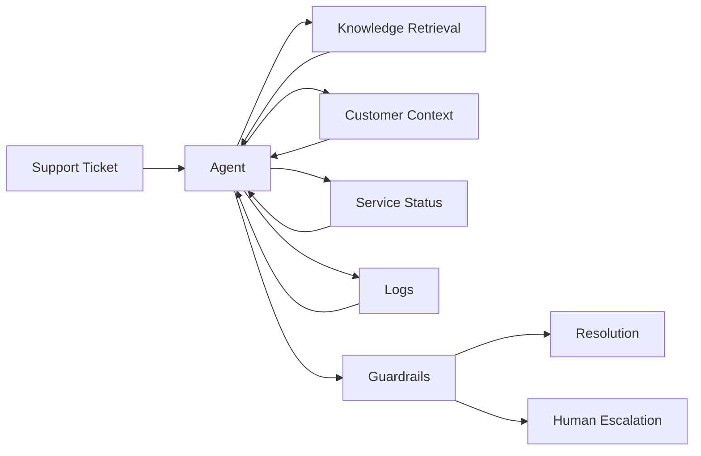

# Dane Edwards — Agentic AI Support Portfolio

A public portfolio demonstrating how my Technical Support, API troubleshooting, escalation, and customer-facing SaaS background can be extended with applied AI and automation.

> **Safety / confidentiality:** Every customer, log, service, ticket, and product example in this repository is fictional and synthetic. No Avalara or former-employer proprietary information is included.

## Portfolio projects

### 1. Atlas Support AI Agent
A support-engineering agent architecture that combines:
- Python
- allow-listed tool calls
- local RAG-style retrieval
- structured investigation results
- explicit context/token budgets
- deterministic escalation guardrails
- optional LLM integration via environment variables
- regression tests

### 2. Incident & Escalation Automation
A safe automation example showing:
- webhook-style ticket intake
- structured severity classification
- deterministic routing
- human approval for high-priority actions
- an importable n8n workflow design

### 3. API Diagnostics Agent
A focused API troubleshooting utility for common HTTP failures including 400, 401, 403, 404, 429, 500, 503, and 504. It produces a diagnosis, verification checklist, escalation guidance, and example cURL commands.

## Why these projects

The goal is not to present AI as a chatbot. The goal is to show how AI can sit inside a controlled technical-support workflow:



## Verification status

Verified in the repository test suite:
- deterministic support investigation path
- synthetic knowledge retrieval
- customer/status/log tools
- escalation policy
- API diagnostic rules
- incident routing logic

Optional live LLM execution requires an API credential and is intentionally not required for the public demo.

## Run tests

```bash
python -m pip install -r requirements.txt
pytest -q
```

## Career positioning

These are personal portfolio projects built from my domain experience in enterprise Technical Support, REST/SOAP integrations, Postman, JSON, logs, incident coordination, escalations, and customer communication. They are not presented as production systems built for a former employer.
