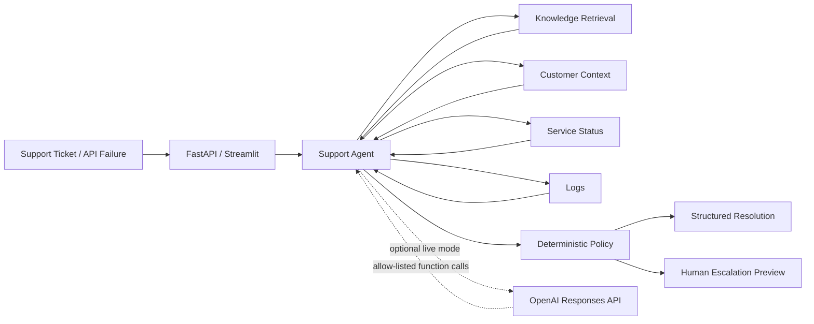

# Dane Edwards — Agentic AI Support & Automation Portfolio

**Technical Support + APIs + Escalations + Applied AI Automation**

A public, synthetic-data portfolio showing how enterprise Technical Support and API troubleshooting workflows can be extended with **Python, LLM tool calling, RAG-style retrieval, FastAPI, Postman-ready REST endpoints, deterministic guardrails, n8n workflow design, evaluations, and observability**.

> **Confidentiality:** Every customer, ticket, log, service-status record, product name, and operational example in this repository is fictional/synthetic. No Avalara or other former-employer proprietary information, credentials, customer data, or internal documentation is included.

## What this portfolio demonstrates

| Project | What it demonstrates | Public status |
|---|---|---|
| **Atlas Support AI Agent** | Support investigation, allow-listed tools, local retrieval, deterministic escalation, optional live LLM tool calling | Runnable offline; live mode requires your own API key |
| **Incident & Escalation Automation** | P1/P2/P3 routing, human-in-the-loop approval, workflow orchestration, n8n import artifact | Runnable Python logic + importable n8n workflow |
| **API Diagnostics Agent** | HTTP/API troubleshooting for 400/401/403/404/429/500/503/504, verification plans, cURL guidance | Runnable offline |
| **FastAPI Support Service** | REST endpoints, Pydantic request/response validation, OpenAPI docs, Postman-ready testing surface | Runnable locally |
| **Streamlit Demo UI** | Recruiter-friendly browser demonstration of all three workflows | Runnable locally |

## Architecture



## Why this is an agent rather than a chatbot

The system is designed around a controlled investigation loop. In optional live mode, the model can request only explicitly approved support functions. The application executes those functions, returns bounded synthetic evidence, and continues the investigation. Consequential actions remain preview-only and high-risk incidents also pass through deterministic Python policy.

The public demo includes these agent concepts:

- **Allow-listed tools** instead of unrestricted system access
- **Retrieval grounding** instead of relying only on model memory
- **Structured outputs** for predictable downstream handling
- **Token/context limits** to bound cost, latency, and runaway context
- **Deterministic guardrails** for P1/high-risk conditions
- **Human approval** for consequential escalation actions
- **Regression tests** for classification and policy behavior
- **Telemetry hooks** for model, latency, token usage, and tools used in live mode

## Quick start

### 1. Install

```bash
python -m venv .venv
```

**Windows PowerShell**

```powershell
.venv\Scripts\Activate.ps1
pip install -r requirements.txt
```

**macOS / Linux**

```bash
source .venv/bin/activate
pip install -r requirements.txt
```

### 2. Run the browser demo

```bash
streamlit run app.py
```

### 3. Run the REST API

```bash
uvicorn api:app --reload
```

Then open the interactive API documentation:

```text
http://127.0.0.1:8000/docs
```

### 4. Test with Postman

```http
GET http://127.0.0.1:8000/health
```

```http
POST http://127.0.0.1:8000/agent/investigate
Content-Type: application/json
```

```json
{
  "ticket": "Customer CUST-101 is receiving HTTP 401 errors after rotating production credentials. Postman works, but the production integration still fails.",
  "mode": "offline"
}
```

### 5. Run tests

```bash
pytest -q
```

## Optional live LLM mode

The default public demo does **not** require an API key. To exercise live LLM function calling, set environment variables locally:

```text
OPENAI_API_KEY=your_key_here
OPENAI_MODEL=gpt-5.6-luna
```

Never commit `.env`, credentials, production logs, customer identifiers, or secrets.

## Portfolio map

```text
.
├── app.py                              # Streamlit recruiter/demo UI
├── api.py                              # FastAPI + OpenAPI/Postman surface
├── requirements.txt
├── test_portfolio.py
├── atlas_support_agent/
│   ├── agent.py                        # deterministic evidence-backed investigation
│   ├── live_agent.py                   # optional Responses API function-calling loop
│   ├── llm_adapter.py                  # bounded LLM summary helper
│   ├── test_agent.py
│   └── README.md
├── incident_escalation_automation/
│   ├── router.py
│   ├── 01_support_escalation_router.n8n.json
│   └── README.md
├── api_diagnostics_agent/
│   ├── diagnose.py
│   └── README.md
└── INTERVIEW_GUIDE.md
```

## Engineering decisions

### Synthetic by design
The portfolio demonstrates architecture without exposing proprietary or customer information.

### Offline-first reliability
The core demo works without an external service, which makes interviews and code review reproducible.

### LLMs do not own high-risk policy
A probabilistic model may recommend escalation, but P1/high-risk signals are also evaluated deterministically.

### Human-in-the-loop by default
The public automation creates previews; it does not send real Slack messages, create Jira tickets, modify customer systems, or write production data.

### Current API integration
Optional live mode uses the OpenAI **Responses API** with function tools. The default cost-sensitive model is `gpt-5.6-luna`, configurable through `OPENAI_MODEL`.

## Interview positioning

This should be described accurately as a **personal portfolio project built from Technical Support domain experience**, not as production AI work performed for a former employer.

A concise explanation:

> “I modernized the support work I already know—API troubleshooting, logs, incident severity, escalation, knowledge retrieval, and customer communication—by building a Python-based agentic support portfolio. The flagship workflow can retrieve evidence, call approved tools, expose REST endpoints through FastAPI, apply deterministic escalation guardrails, and optionally use an LLM through controlled function calling. I kept all public data synthetic so the complete architecture is safe to demonstrate.”

## Verified locally

The deterministic public suite covers authentication troubleshooting, outage escalation, incident routing, API diagnostics, and the portfolio integration path. Live LLM execution is intentionally separate because it requires a user-provided credential.

---

**Dane Edwards**  
Technical Support • Technical Account Management • API/Integration Troubleshooting • Applied AI Automation