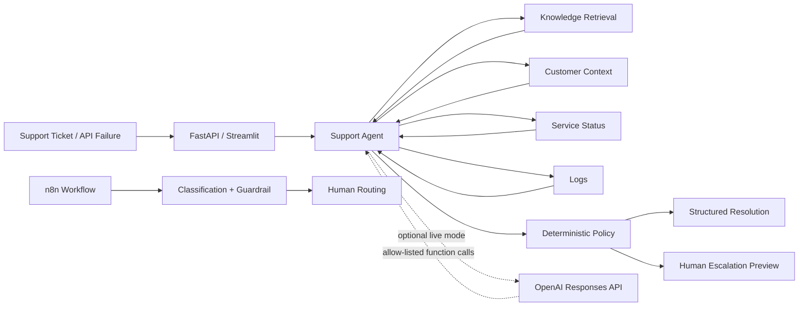

# Dane Edwards — Agentic AI Support & Automation Portfolio

[](https://github.com/danecodesnc/hello-world/actions/workflows/tests.yml)
[](https://github.com/danecodesnc/hello-world/actions/workflows/n8n-verification.yml)

**Technical Support + APIs + Escalations + Applied AI Automation**

## 👋 Start here — no technical knowledge needed

### Easiest option: click the live demo

**[▶ OPEN THE LIVE PORTFOLIO](https://ai-support-portfolio-production.up.railway.app)**

Nothing to install. No commands to type. Open the link, choose a tab, and click a button.

### Windows one-click option

If you downloaded this repository to a Windows computer:

1. Double-click **`START_HERE_WINDOWS.bat`**.
2. The program prepares itself and opens in your browser.
3. Keep the green launcher window open while using the program.
4. Close the green window when finished.

Want a normal desktop icon? Double-click **`CREATE_DESKTOP_ICON_WINDOWS.bat`** once. It creates a shortcut called **Dane AI Support Portfolio** on the Windows desktop. After that, use the desktop icon.

> The first local run needs Python. If Python is missing, the launcher explains that in plain English and opens the official Python download page.

---

A public, synthetic-data portfolio showing how enterprise Technical Support and API troubleshooting workflows can be extended with **Python, LLM tool calling, RAG-style retrieval, FastAPI, Postman-ready REST endpoints, deterministic guardrails, n8n workflow orchestration, evaluations, and observability**.

> **Confidentiality:** Every customer, ticket, log, service-status record, product name, and operational example in this repository is fictional/synthetic. No Avalara or other former-employer proprietary information, credentials, customer data, or internal documentation is included.

## What can I click in the demo?

The browser application has four simple tabs:

| Tab | What you do | What happens |
|---|---|---|
| **Support Agent** | Read the sample ticket and click **Investigate ticket** | The agent gathers synthetic evidence, classifies the problem, recommends troubleshooting, and decides whether escalation is required |
| **Incident Router** | Read the incident signal and click **Route incident** | The workflow chooses P1/P2/P3-style routing and protects high-risk actions with human approval |
| **API Diagnostics** | Pick an HTTP status and click **Diagnose API failure** | The tool explains the API error and gives a verification plan |
| **Architecture** | Just read it | A simple diagram explains how the controlled agent works |

The default **Offline deterministic demo** works without an API key and is the safest mode for an interview demonstration.

## Portfolio projects

| Project | What it demonstrates | Verification status |
|---|---|---|
| **[Atlas Support AI Agent](atlas_support_agent/)** | Support investigation, allow-listed tools, local retrieval, deterministic escalation, optional live LLM tool calling | ✅ Offline path regression-tested; ✅ tool-call loop/telemetry CI-tested with a deterministic mock provider; ⏳ real external LLM call requires a private API credential |
| **[Incident & Escalation Automation](incident_escalation_automation/)** | P1/P2/P3 routing, human-in-the-loop approval, workflow orchestration | ✅ Python logic tested |
| **[n8n Orchestration Verification](n8n_runner/)** | Trigger → normalization → classification → deterministic guardrail → human-routing decision | ✅ Imported and executed successfully inside the official n8n container in GitHub Actions |
| **[API Diagnostics Agent](api_diagnostics_agent/)** | HTTP/API troubleshooting for 400/401/403/404/429/500/503/504, verification plans, cURL guidance | ✅ Regression-tested offline |
| **[FastAPI Support Service](api.py)** | REST endpoints, Pydantic request/response validation, OpenAPI docs, Postman-ready testing surface | ✅ Endpoint behavior tested with FastAPI TestClient; runnable locally |
| **[Streamlit Demo UI](app.py)** | Recruiter-friendly browser demonstration of the workflows | ✅ Public demo + runnable locally |

## Architecture



## Why this is an agent rather than just a chatbot

The system is designed around a controlled investigation loop. In optional live mode, the model can request only explicitly approved support functions. The application executes those functions, returns bounded synthetic evidence, and continues the investigation. Consequential actions remain preview-only, and high-risk incidents also pass through deterministic Python policy.

The portfolio demonstrates:

- allow-listed tools rather than unrestricted system access
- retrieval grounding rather than relying only on model memory
- structured outputs for predictable downstream handling
- token/context limits to bound cost, latency, and runaway context
- deterministic guardrails for P1/high-risk conditions
- human approval for consequential escalation actions
- regression tests for classification and policy behavior
- telemetry for model, latency, token usage, and tools used in live mode
- executable n8n orchestration rather than a diagram-only workflow

## Verification matrix — what is actually proven

| Capability | How it is verified | Current claim boundary |
|---|---|---|
| Python support logic | Pytest regression suite | **Verified** |
| FastAPI endpoints | FastAPI TestClient regression tests | **Verified** |
| Deterministic escalation guardrails | P1/high-risk regression tests | **Verified** |
| LLM function-call control loop | Automated test with a deterministic mock provider | **Implementation/loop verified**; this is not the same as a real provider network call |
| Token + latency telemetry plumbing | Automated loop test | **Instrumentation verified** |
| n8n orchestration | GitHub Actions imports and executes the workflow in the official n8n container and checks for `verification: PASS` | **Verified real n8n execution** |
| External OpenAI Responses API execution | Credential-gated manual workflow + `scripts/verify_live_llm.py` | **Ready but not marked verified until a private `OPENAI_API_KEY` is configured and the workflow passes** |

This distinction is intentional. The repository does not label an external LLM call as verified until a real credential-backed run succeeds.

## For developers: manual local start

The one-click launcher is recommended for Windows. Developers can also run it manually:

```bash
python -m venv .venv
pip install -r requirements.txt
streamlit run app.py
```

Run the REST API separately with:

```bash
uvicorn api:app --reload
```

Interactive API documentation:

```text
http://127.0.0.1:8000/docs
```

### Postman example

```http
GET http://127.0.0.1:8000/health
```

```http
POST http://127.0.0.1:8000/agent/investigate
Content-Type: application/json
```

```json
{
  "ticket": "Customer CUST-101 is receiving HTTP 401 errors after rotating production credentials. Postman works, but the production integration still fails.",
  "mode": "offline"
}
```

## Optional live LLM mode

The default public demo does **not** require an API key. To exercise live LLM function calling locally, set:

```text
OPENAI_API_KEY=your_key_here
OPENAI_MODEL=gpt-5.6-luna
```

Then run the credential-gated verification:

```bash
python scripts/verify_live_llm.py
```

A valid verification must observe all of the following before it prints `LIVE_LLM_VERIFICATION_COMPLETE`:

- a real live-mode result;
- a provider model identifier;
- non-empty final model output;
- at least one allow-listed function call;
- recorded input tokens;
- recorded output tokens;
- measured latency.

GitHub also contains a manually triggered **Live LLM Verification** workflow. It is intentionally not shown with a green verification badge until a private repository secret named `OPENAI_API_KEY` exists and a real run succeeds.

Never commit `.env`, credentials, production logs, customer identifiers, or secrets.

## Repository map

```text
.
├── START_HERE_WINDOWS.bat              # simple double-click Windows launcher
├── CREATE_DESKTOP_ICON_WINDOWS.bat     # creates a normal Windows desktop shortcut
├── Procfile                            # hosted Streamlit start command
├── app.py                              # recruiter-friendly Streamlit UI
├── api.py                              # FastAPI + OpenAPI/Postman surface
├── requirements.txt
├── test_portfolio.py
├── scripts/
│   └── verify_live_llm.py              # requires a real private API credential; fails closed
├── .github/workflows/
│   ├── tests.yml                       # regression suite
│   ├── n8n-verification.yml            # imports + executes workflow in official n8n container
│   └── live-llm-verification.yml       # manual real-provider verification
├── n8n_runner/
│   └── workflow.json                   # deterministic executable n8n verification workflow
├── atlas_support_agent/
│   ├── agent.py                        # deterministic evidence-backed investigation
│   ├── live_agent.py                   # optional Responses API function-calling loop
│   ├── llm_adapter.py                  # bounded LLM summary helper
│   ├── test_agent.py
│   └── test_live_agent_loop.py         # mock-provider tool-loop + telemetry verification
├── incident_escalation_automation/
│   ├── router.py
│   ├── 01_support_escalation_router.n8n.json
│   └── README.md
├── api_diagnostics_agent/
│   ├── diagnose.py
│   └── README.md
└── INTERVIEW_GUIDE.md
```

## Engineering decisions

**Synthetic by design.** The portfolio demonstrates architecture without exposing proprietary or customer information.

**Offline-first reliability.** The core demo works without an external AI service, making interviews and code review reproducible.

**LLMs do not own high-risk policy.** A probabilistic model may recommend escalation, but P1/high-risk signals are also evaluated deterministically.

**Human-in-the-loop by default.** The public automation creates previews; it does not send real Slack messages, create Jira tickets, modify customer systems, or write production data.

**Verification is evidence-based.** A file existing in the repository is not treated as proof that it ran. The n8n badge comes from an actual containerized import and execution; the external LLM path stays explicitly unverified until a real credential-backed run passes.

## Interview positioning

This should be described accurately as a **personal portfolio project built from Technical Support domain experience**, not as production AI work performed for a former employer.

> “I modernized the support work I already know—API troubleshooting, logs, incident severity, escalation, knowledge retrieval, and customer communication—by building a Python-based agentic support portfolio. The flagship workflow retrieves synthetic evidence through controlled tools, exposes REST endpoints through FastAPI, applies deterministic escalation guardrails, and includes an optional LLM function-calling path. I also built and actually executed an n8n orchestration workflow in CI. I kept all public data synthetic so the complete architecture is safe to demonstrate.”

See **[INTERVIEW_GUIDE.md](INTERVIEW_GUIDE.md)** for the 30-second pitch, five-minute walkthrough, terminology, demo scenarios, and accuracy boundaries.

## Verification

The public CI suite covers authentication troubleshooting, outage escalation, incident routing, API diagnostics, REST endpoint behavior, and the internal function-call/telemetry control loop. A separate GitHub Actions workflow imports and executes the n8n workflow in the official n8n container. External OpenAI execution remains credential-gated and is intentionally reported separately until a real run succeeds.

---

**Dane Edwards**  
Technical Support • Technical Account Management • API/Integration Troubleshooting • Applied AI Automation
